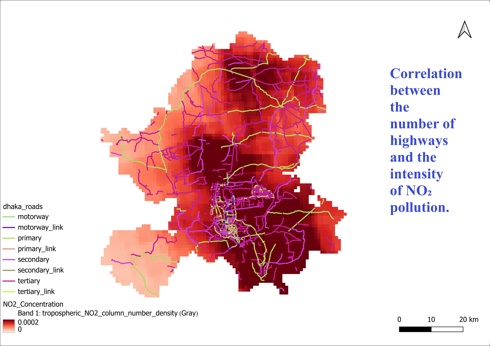
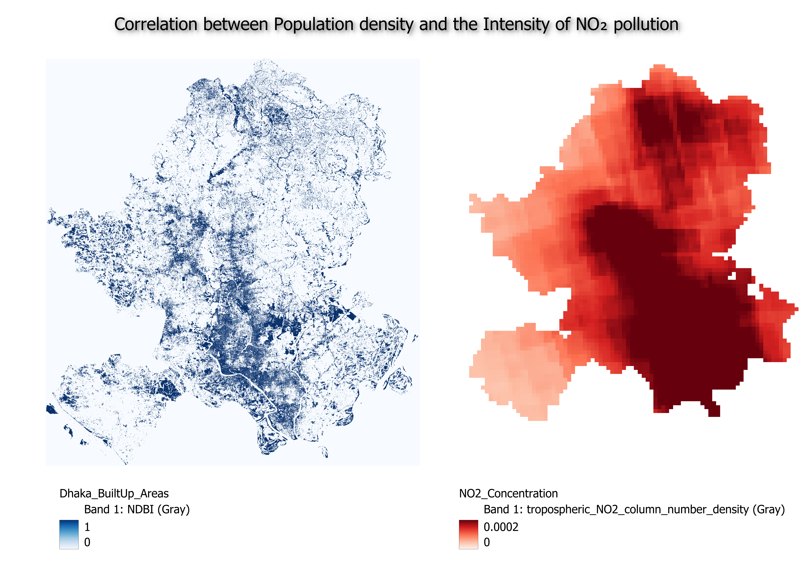

# Comparing NO₂ Air Pollution with Traffic and Population Density

This project compares NO₂ air pollution levels with traffic intensity (measured by the number of highways) and population density using QGIS and Python.
 
## Features

- **Correlation between the Number of Highways and NO₂ Pollution**
- **Correlation between Population Density and NO₂ Pollution**

### Example Visualizations

Below are example visualizations generated from the analysis:

1. **NO₂ Pollution vs. Highways**



2. **NO₂ Pollution vs. Population Density**



---

## Data Sources

- **Sentinel-5P:** NO₂ pollution data.
- **OpenStreetMap:** Highway network data.
- **Census Records:** Population density data.

## Tools and Technologies

- **QGIS:** For spatial data processing and map creation.
- **Python:** For statistical analysis and visualizations.

## How to Use

1. **Clone the Repository:**
   ```bash
   git clone https://github.com/yourusername/Comparing-NO2-Pollution.git
   ```

2. **Run Analysis Scripts:**
   - Use Python scripts to analyze the data and generate results.

3. **View in QGIS:**
   - Open the provided QGIS project file to explore the spatial relationships visually.

---

## License

This project is licensed under the MIT License.

## Acknowledgments

- Sentinel-5P for air pollution data.
- OpenStreetMap for highway information.
- Census authorities for population density records.

